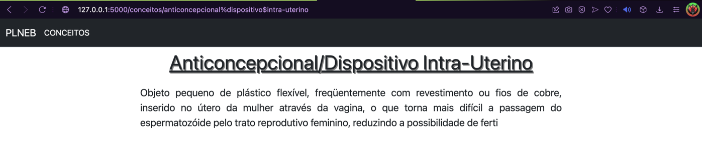

# Ficha 5
___
___
### Descrição do trabalho efetuado:
___
O objetivo desta ficha focou-se no desenvolvimento 
da aplicação _flask_ começada em aula adicionando uma
funcionalidade que, ao clicar num conceito da página
de conceitos uma página referente ao conceito seja
aberta, contendo a descrição do conceito.

### Maiores desafios:
___
O maior desafio deste trabalho encontrou-se na fase de
planificação de "como criar as páginas?" tendo sido
optada a criação de um _script python_ encarregue
da criação das diferentes páginas _web_. Um problema
encontrado na criação desse _script_ foi o facto de 
alguns conceitos conterem o caractere "/" interferindo
com o seu _url_. ~~Esse problema foi resolvido~~ (ver
Atualização 2) substituindo o caractere anteriormente 
referido por "-", através do método _sub_ do _ReGex_.

### Highlights:
___
Para terminar, sinto que não há muitos aspetos a 
realçar. Senti que este trabalho conseguiu incorporar
muitos conceitos de fichas anteriores e isso deixou-me, 
de certa forma, satisfeito com o processo e o resultado.
Gostava apenas de acrescentar que na função referente
às diversas páginas de conceitos foi criado um _if 
statement_ que verifica se o conceito é ou não o termo
"Significado", visto que este consta no ficheiro 
"conceitos.json" e não é efetivamente um dos termos do
dicionário. Se o conceito for o anteriormente
mencionado, ou seja, se for o termo clicado na lista, 
então é feito um redirecionamento para a página 
"http://127.0.0.1:5000/conceitos", 
que é a própria página onde a lista de termos se
encontra, tornando o clique nesse termo algo sem 
reação aparente.

### Atualização 1:
___
Em retrosptiva a criação de um ficheiro _html_
dedicado a cada termo, mesmo que feito de forma 
automatizada é, acima de tudo, um problema quando
se trata do volume de dados da _app_, assim optei 
pela modificação do anterior projeto, "plneb_flask",
fazendo com que, visto que todas as páginas de 
termos são identicas exceto ao nível do conteúdo,
existisse apenas um ficheiro _html_ para onde é 
carregado diferente conteúdo, dependendo do termo 
clicado. O comportamento visual da _app_ manteve-se 
igual, pelo que não é necessária uma atualização da
secção "Imagens da app" deste _README_.

### Atualização 2:
___
No novo projeto (plneb_flask(alternativa)) havia 
problemas aquando do _handling_ de termos contendo 
o caractere "/" visto que uma simples substituição 
por "-" criava problemas no _handling_ de termos 
que ja continham esse caratere antes da substituição. 
Assim, de modo a resolver o problema, os caracteres 
"/" e " " foram substituídos por "%" e "$" 
respetivamente, dentro de um _script JavaScript_ (_JS_) 
contido no ficheiro _html_ "conceitos.html".
Dentro da função "conceito", do ficheiro "app.py" do 
projeto, os conceitos são novamente restaurados para
a sua forma original, substituindo os "%" e "$" para
"/" e " " de novo, de forma a possibilitar o acesso
ao dicionário "conceitos", obtido através do ficheiro
"conceitos.json".

Esta nova implementação, feita no projeto 
"plneb_flask(alternativa)", foi aquela de que mais
me orgulho e que considero ter realmente _highlights_,
principalmente a nível da criação de _urls_ dinâmicos,
feito através de um _script JS_, como anteriormente 
mencionado.

### Imagens da app:
___

Imagem que ilustra um termo contendo "/" e " ":

