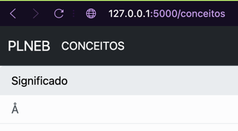
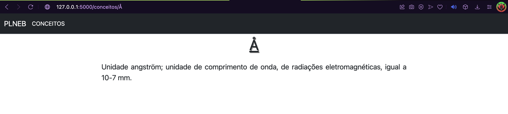
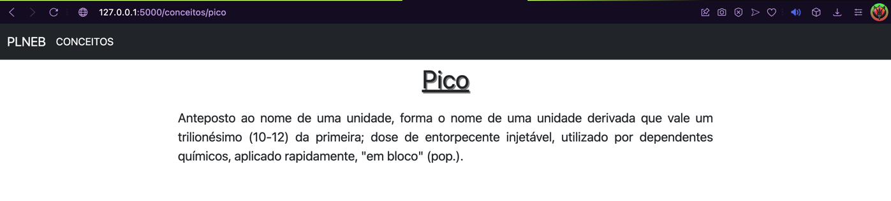

# Ficha 5
___
___
### Descrição do trabalho efetuado:
___
O objetivo desta ficha focou-se no desenvolvimento 
da aplicação _flask_ começada em aula adicionando uma
funcionalidade que, ao clicar num conceito da página
de conceitos uma página referente ao conceito seja
aberta, contendo a descrição do conceito.

### Maiores desafios:
___
O maior desafio deste trabalho encontrou-se na fase de
planificação de "como criar as páginas?" tendo sido
optada a criação de um _script python_ encarregue
da criação das diferentes páginas _web_. Um problema
encontrado na criação desse _script_ foi o facto de 
alguns conceitos conterem o caracter "/" interferindo
com o seu _url_. Esse problema foi resolvido 
substituindo o caracter anteriormente referido por
"-", através do método _sub_ do _ReGex_.

### Highlights:
___
Para terminar, sinto que não há muitos aspetos a 
realçar. Senti que este trabalho conseguiu incorporar
muitos conceitos de fichas anteriores e isso deixou-me, 
de certa forma, satisfeito com o processo e o resultado.
Gostava apenas de acrescentar que na função referente
às diversas páginas de conceitos foi criado um _if 
statement_ que verifica se o conceito é ou não o termo
"Significado", visto que este consta no ficheiro 
"conceitos.json" e não é efetivamente um dos termos do
dicionário. Se o conceito for o anteriormente
mencionado, ou seja, se for o termo clicado na lista, 
então é feito um redirecionamento para a página 
"http://127.0.0.1:5000/conceitos", 
que é a própria página onde a lista de termos se
encontra, tornando o clique nesse termo algo sem 
reação aparente.

### Imagens da app:
___

